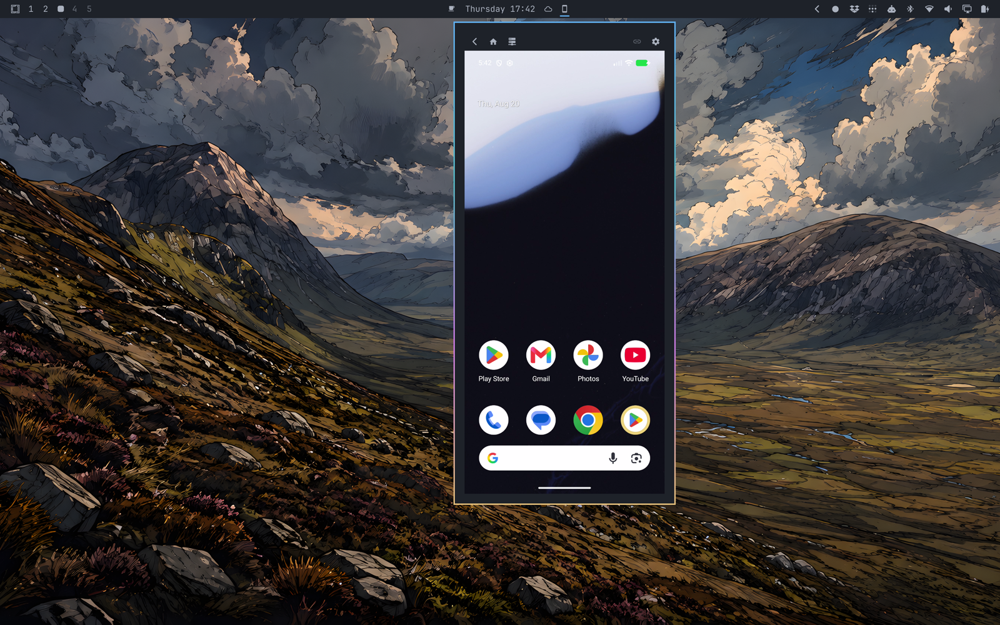

# Droid Peek

Your Android device. In the Omarchy bar.

Pair once over Wireless debugging. Open the plugin to see and control the
device, type into it, and use Omarchy keybindings to open Android apps.

No Android app or root access is required. Droid Peek remembers one device and
uses unmodified [scrcpy](https://github.com/Genymobile/scrcpy) underneath.



## Install

### 1. Install the dependencies

```bash
omarchy pkg add scrcpy qt6-multimedia v4l2loopback-dkms linux-headers
```

Omarchy installs only packages that are missing and keeps them updated with the
rest of your system. Droid Peek setup does not install packages.

### 2. Add Droid Peek

```bash
omarchy plugin add https://github.com/ollieedgeley/droid-peek.git
```

When Omarchy asks whether to enable the plugin, choose **No**. Setup requires
the plugin to remain disabled until its checks finish.

### 3. Configure Droid Peek

```bash
cd ~/.config/omarchy/plugins/ollieedgeley.droidpeek
scripts/setup-droid-peek
```

Setup prints its plan before changing anything. It installs a checksum- and
version-verified Rust helper that runs the Android-device session, prepares the
named V4L2 camera that carries the picture into the panel, checks Omarchy's
existing Avahi service for local-network discovery, and creates your bindings
file without overwriting later edits. It also adds one managed loader to your
Hyprland bindings.

Setup does not install system packages, enable Avahi, or enable the plugin. See
[Install, update, or remove](docs/how-to-install-update-remove.md) for dry-run,
automation, helper-source, update, and cleanup details.

### 4. Enable Droid Peek

After setup reports successful verification:

```bash
omarchy plugin enable ollieedgeley.droidpeek
```

## See your device

On the Android device, enable
[Developer options](https://developer.android.com/studio/debug/dev-options),
then open **Developer options → Wireless debugging → Pair device with QR
code**.

Open the **Droid Peek** bar icon on the Omarchy computer. Scan the QR code shown
in the panel with the Android device. Settings names and locations vary by
manufacturer; use Android's official
[Wireless debugging guidance](https://developer.android.com/tools/adb#connect-to-a-device-over-wi-fi)
if you cannot find an option.

Opening the panel later attempts to reconnect to the remembered device.

## Use it

The bar icon opens or closes the panel. Android mode is active only while the
panel is open, **Android-mode shortcuts** is enabled, and the session is
interactive. In that state, `Super+Alt+A` closes the panel and configured
chords go to Android instead of the desktop. Closing the panel or disabling the
setting restores normal desktop bindings.

Setup creates `~/.config/hypr/droid-peek.lua` once. For example:

```lua
-- Navigation
android.bind("SUPER + W", "Home", "android.navigate.home")

-- Optional: enable only if this package is installed on the device
android.bind("SUPER + RETURN", "Termux", {
  type = "android.app.launch", package = "com.termux"
})

-- Copy and paste inside Android; these do not sync the desktop clipboard
android.bind("SUPER + C", "Copy", { type = "android.keyevent", key = "copy" })
android.bind("SUPER + V", "Paste", { type = "android.keyevent", key = "paste" })
```

The shipped app-launch examples are commented out because installed package
names vary. See [Use and configure](docs/how-to-use-and-configure.md) and the
full [binding reference](docs/reference.md).

## More

| I want to… | Go here |
| --- | --- |
| Install, update, or remove | [Installation guide](docs/how-to-install-update-remove.md) |
| Change bindings or settings | [Use and configure](docs/how-to-use-and-configure.md) |
| Fix something | [Fix problems](docs/how-to-fix-problems.md) |
| Look up a chord, setting, or path | [Reference](docs/reference.md) |
| Understand the design | [How Droid Peek works](docs/explanation.md) |
| Prepare or verify a release | [Verification guide](docs/how-to-verify.md) |

## Credit

Droid Peek is built on [scrcpy](https://github.com/Genymobile/scrcpy), the
open-source Android mirroring project by its author and maintainer,
[Romain Vimont (`@rom1v`)](https://github.com/rom1v). Droid Peek uses scrcpy's
Linux V4L2 output to bring the Android device screen into the Omarchy panel.

### Support scrcpy

- [Sponsor Romain on GitHub](https://github.com/sponsors/rom1v)
- [Support Romain on PayPal](https://paypal.me/rom2v)

### Support Ollie

- Follow [Ollie on X](https://x.com/OllieEdgeley)
- Support Ollie on [PayPal](https://paypal.me/ollieedgeley)

[MIT License](LICENSE)
